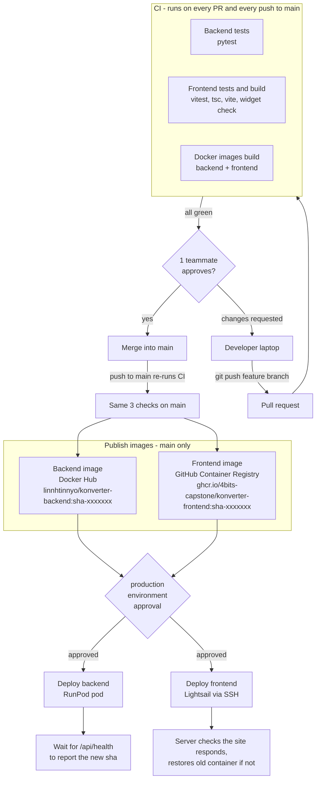
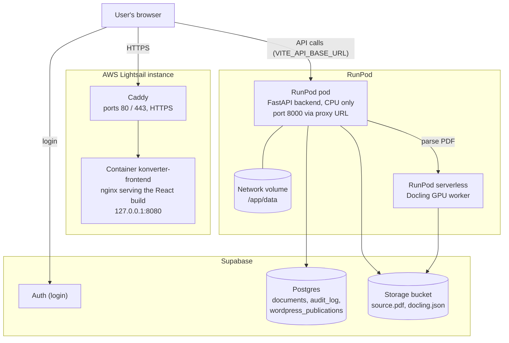
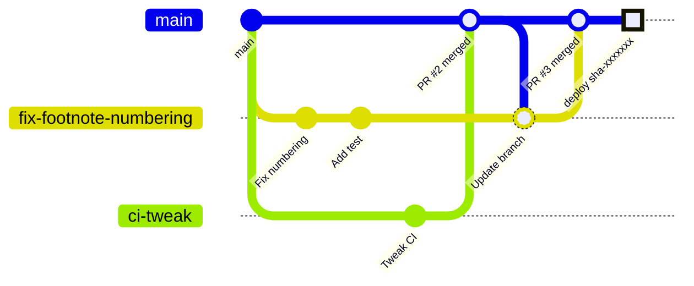
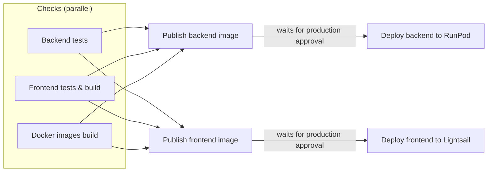
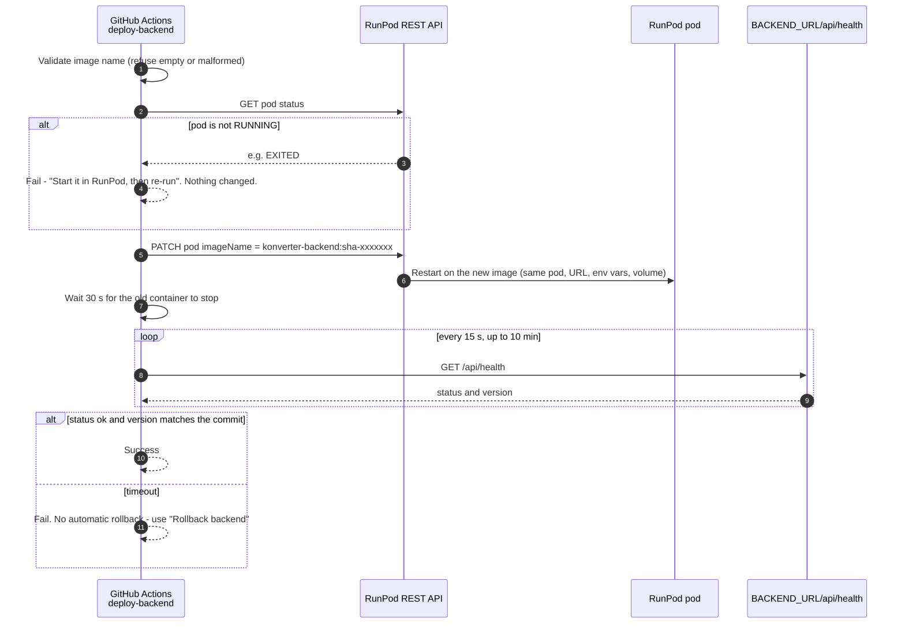
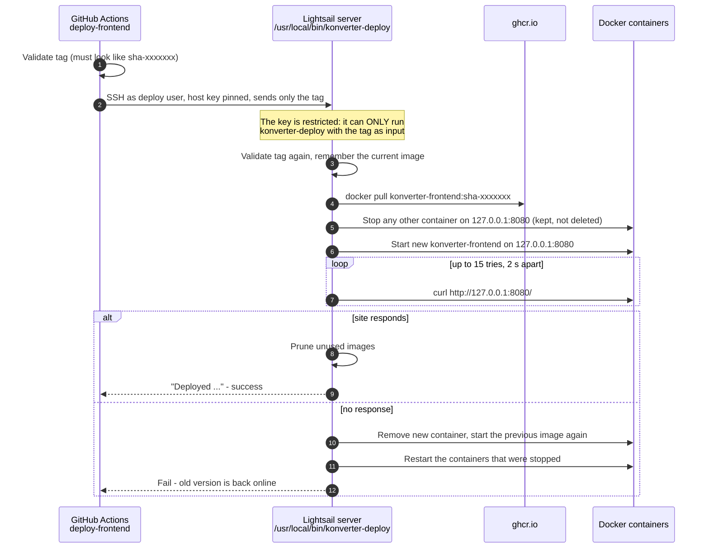
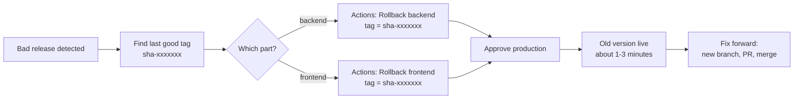

# Konverter CI/CD Guide

This guide covers how code gets from a laptop to production: branching, pushing,
pull requests, the merge rules on `main`, automatic tests, image publishing,
deployment, rollback and troubleshooting.

> **Short version:** branch from `main` → push your branch → open a PR → 3 checks
> go green → 1 teammate approves → merge → GitHub builds images → someone
> approves the **production** deploy → backend (RunPod) and frontend (Lightsail)
> update by themselves.

---

## Contents

1. [The big picture](#1-the-big-picture)
2. [Where things run](#2-where-things-run)
3. [Rules on `main` (merge rules)](#3-rules-on-main-merge-rules)
4. [Day-to-day workflow: from branch to merge](#4-day-to-day-workflow-from-branch-to-merge)
5. [What CI checks on every PR](#5-what-ci-checks-on-every-pr)
6. [What happens after a merge (CD)](#6-what-happens-after-a-merge-cd)
7. [Approving a deployment](#7-approving-a-deployment)
8. [Rolling back](#8-rolling-back)
9. [Secrets, variables and settings](#9-secrets-variables-and-settings)
10. [Things CI/CD does *not* do](#10-things-cicd-does-not-do)
11. [Troubleshooting](#11-troubleshooting)
12. [Repo hygiene](#12-repo-hygiene)
13. [Cheat sheet](#13-cheat-sheet)
14. [File reference](#14-file-reference)

---

## 1. The big picture



Every arrow in this diagram is automatic **except** three human steps:

| Human step | Who | Where |
|---|---|---|
| Open the PR | Author | GitHub → Pull requests |
| Approve the PR | The other teammate | PR → Files changed → Review changes → Approve |
| Approve the production deploy | A required reviewer of the `production` environment | Actions → the CI run on `main` → Review deployments |

---

## 2. Where things run



| Piece | Runs on | Deployed by CI/CD? |
|---|---|---|
| Frontend (React + nginx) | Lightsail, container `konverter-frontend` on `127.0.0.1:8080`, behind Caddy | **Yes**, `deploy-frontend` job |
| Backend (FastAPI) | One RunPod **pod** (the same pod every release, so its URL never changes) | **Yes**, `deploy-backend` job |
| Docling worker (`docling_worker/`) | RunPod **serverless** endpoint | **No**, built and pushed by hand |
| Database / auth / file storage | Supabase | **No**, SQL in `backend/sql/` is run by hand |
| Documents | Network volume at `/app/data` on the pod | Kept across deploys (the pod is updated in place, not replaced) |

---

## 3. Rules on `main` (merge rules)

`main` is protected by a GitHub ruleset. These rules apply to everyone:

| Rule | What it means for you |
|---|---|
| **No direct pushes** | `git push origin main` is rejected. Every change goes through a pull request. |
| **Pull request required** | Open a PR from your branch into `main`. |
| **1 approval required** | The other teammate must click *Approve*. You cannot approve your own PR. |
| **New commits reset approval** | If you push again after approval, the reviewer must approve again. |
| **3 status checks must pass** | `Backend tests`, `Frontend tests & build`, `Docker images build`. |
| **Branch must be up to date** | If someone merged first, click **Update branch** (checks re-run). |
| **No force-push, no deletion** | `main`'s history can't be rewritten or deleted. |
| **Admin bypass (emergency only)** | A repo admin can tick *"Merge without waiting for requirements to be met"*. That skips review, so use it rarely and only when checks are green. |

A merge into `main` **does not** deploy on its own. Deploys always wait for the
`production` approval described in [section 7](#7-approving-a-deployment).

---

## 4. Day-to-day workflow: from branch to merge

### Branching model

We use **short-lived feature branches** off `main`. There is no `develop` or
`release` branch. One branch = one task.



**Branch names:** short, lowercase, hyphenated, describing the task. Prefixes
used so far: `ci/...` for pipeline work, `docs/...` for documentation. For app
work a plain name is fine (`fix-footnote-numbering`, `quote-detection`).

### Step by step

**Step 1: start from the latest `main`**

```bash
git switch main
git pull
```

**Step 2: create a branch**

```bash
git switch -c fix-footnote-numbering
```

**Step 3: work and commit** (as many commits as you like)

```bash
git status                 # see what changed
git add src/pages/ReviewPage.tsx backend/app/exporter.py   # add files BY NAME
git diff --staged          # double-check what will be committed
git commit -m "Fix footnote numbering in exporter"
```

> Add files by name, not with `git add .`. That way `.env`, notes and other stray
> files never slip into a commit.

**Step 4: run the checks locally (optional but saves time)**

```bash
# backend
cd backend && python -m pytest && cd ..

# frontend
npm test
npm run build

# only if you changed src/widget/embed.ts
npm run build:widget       # then commit backend/app/static/widget/
```

**Step 5: push your branch** (never `main`)

```bash
git push -u origin fix-footnote-numbering   # first time
git push                                    # after that
```

**Step 6: open a pull request**

The push prints a link like `.../pull/new/fix-footnote-numbering`. Open it,
write a title and a short description (what changed and why), add the other
teammate under **Reviewers**, then click **Create pull request**.

**Step 7: wait for the 3 checks** (a few minutes)

- All green → go to step 8.
- Any red → click **Details** to see the log, fix it **on the same branch**,
  commit and `git push`. The PR updates and checks re-run. No new PR needed.
  If you push again, CI cancels the older run for that PR to save time.

**Step 8: get approval**

The reviewer opens **Files changed** → **Review changes** → **Approve** (or
**Request changes** with a comment). Pushing new commits resets the approval.

**Step 9: merge**

Click **Merge pull request** → **Confirm**, then **Delete branch**.

**Step 10: tidy up locally**

```bash
git switch main
git pull
git branch -d fix-footnote-numbering
```

Then go back to step 2 for the next task.

### Commit messages

One short line in the imperative mood that says what changed:

| Good | Bad |
|---|---|
| `Fix footnote numbering in exporter` | `update` |
| `Deploy frontend on 127.0.0.1:8080` | `fix stuff` |
| `Add RunPod job timeout` | `changes` |

### Reviewing a PR

1. Read the description and the **Files changed** tab.
2. Check the 3 checks are green (or will be).
3. Look for: correctness, secrets accidentally committed, unrelated changes
   mixed in, missing tests for new logic.
4. **Approve**, or **Request changes** with a comment that says why.

---

## 5. What CI checks on every PR

Workflow file: [`.github/workflows/ci.yml`](../.github/workflows/ci.yml).
It runs on **every pull request**, **every push to `main`** (except docs-only
pushes, see below), and can be started by hand (**Actions → CI → Run workflow**).

### Docs-only changes

| Event | Changes only `docs/**` or `*.md` files | Changes anything else too |
|---|---|---|
| Pull request | Checks **run** | Checks run |
| Push / merge to `main` | **Nothing runs**: no images, no deploy prompt | Everything runs as usual |

- **Why PRs still run:** the 3 checks are required by the `main` ruleset. If a
  PR skipped them, GitHub would wait for them forever and the PR could never be
  merged. They take a few minutes and change nothing.
- **Why `main` skips:** a docs merge doesn't change either image, so rebuilding
  and offering a deploy (which restarts the backend) is pointless.
- **Mixed changes always run.** If a merge touches even one non-Markdown file,
  the whole pipeline runs. Nothing real can slip through as "docs".
- **Need a build anyway?** **Actions → CI → Run workflow** on `main` runs the
  full pipeline, including publish and the deploy prompt.
- The filter lives in `ci.yml` under `on.push.paths-ignore`. If a build or test
  ever starts reading a Markdown file, take that pattern out.

The three check jobs run **in parallel**:

| Check name (as shown on the PR) | What it does | Fails when |
|---|---|---|
| **Backend tests** | Python 3.12, `pip install -e "./backend[dev]"`, then `python -m pytest` in `backend/` | Any pytest test fails, or the backend can't be installed |
| **Frontend tests & build** | Node 20, `npm ci`, `npm test` (vitest), `npm run build` (TypeScript type-check + Vite build), then `npm run build:widget` and compares the result with the committed file | Any vitest test fails, a type error, a build error, or `backend/app/static/widget/` is out of date |
| **Docker images build** | Builds `backend.Dockerfile` and `frontend.Dockerfile` (no push) | Either Dockerfile no longer builds |

Timeouts: 15 min for tests, 20 min for Docker. Dependencies and Docker layers
are cached between runs, so repeat runs are faster.

**Concurrency:** on a PR, a newer push cancels the older run. Runs on `main` are
never cancelled, because they publish images.

---

## 6. What happens after a merge (CD)

Merging into `main` is a push to `main`, so the same CI workflow runs again
(unless the merge only changed docs, see [Docs-only changes](#docs-only-changes)).
When all 3 checks pass, four more jobs run. **They only run for pushes to
`main`, never for PRs.**



### 6.1 Image tags

Every image gets two tags:

- `sha-xxxxxxx`: the first 7 characters of the commit. **This is the version.
  Deploys and rollbacks always use this tag.**
- `latest`: a convenience tag. Deploys never use it.

So `sha-e7ed1ee` always means "the code at commit `e7ed1ee`".

### 6.2 Publish backend image

- Builds `backend.Dockerfile` with `GIT_SHA=<full commit sha>` baked in. The
  running backend reports this at `GET /api/health` →
  `{"status": "ok", "version": "<sha>"}`.
- Pushes to **Docker Hub**: `linnhtinnyo/konverter-backend:sha-xxxxxxx` and `:latest`.

### 6.3 Publish frontend image

- **First checks** that the repository variables `VITE_API_BASE_URL`,
  `VITE_SUPABASE_URL` and `VITE_SUPABASE_ANON_KEY` are set. Vite bakes these
  into the JavaScript at build time; without them the site would talk to
  `localhost`, so the job refuses to publish.
- Builds `frontend.Dockerfile` (Vite build served by nginx) with those values.
- Pushes to **GitHub Container Registry**:
  `ghcr.io/4bits-capstone/konverter-frontend:sha-xxxxxxx` and `:latest`.

### 6.4 Deploy backend to RunPod

Script: [`.github/scripts/deploy-runpod.sh`](../.github/scripts/deploy-runpod.sh)



Key points:

- The **same pod** is updated in place. Its ID, proxy URL, environment variables
  and the `/app/data` volume are kept, so the frontend never needs rebuilding
  because the backend moved.
- If the pod is **stopped**, the deploy refuses and changes nothing. Starting
  the pod costs money, so a person does that in RunPod, then clicks
  **Re-run failed jobs**.
- The job only succeeds when `/api/health` reports the **new** commit, so a
  green job means the new code is really serving.
- There is **no automatic rollback** for the backend. If it fails, see
  [section 8](#8-rolling-back).

### 6.5 Deploy frontend to Lightsail

Scripts: [`.github/scripts/deploy-lightsail.sh`](../.github/scripts/deploy-lightsail.sh)
(runs on GitHub) and [`deploy/lightsail/konverter-deploy.sh`](../deploy/lightsail/konverter-deploy.sh)
(runs on the server).



Key points:

- The frontend deploy **rolls itself back** if the new container doesn't serve.
- Caddy keeps serving ports 80/443 and forwards to `127.0.0.1:8080`. Neither
  the deploy nor a rollback touches Caddy.
- The SSH key GitHub holds is locked down on the server
  (`restrict,command="/usr/local/bin/konverter-deploy"` in `authorized_keys`).
  It can't open a shell, it can only deploy a tag.
- ⚠️ **The server runs its own installed copy** of `konverter-deploy.sh`.
  Editing `deploy/lightsail/konverter-deploy.sh` in the repo changes **nothing**
  until the server admin reinstalls it:
  `sudo install -m 755 konverter-deploy.sh /usr/local/bin/konverter-deploy`.

### 6.6 Locks (concurrency)

| Lock | Used by | Effect |
|---|---|---|
| `deploy-production` | `deploy-backend`, `Rollback backend` | Only one backend deploy/rollback at a time; others queue |
| `deploy-frontend` | `deploy-frontend`, `Rollback frontend` | Only one frontend deploy/rollback at a time; others queue |
| `ci-refs/heads/main` | Whole CI run on `main` | Only one `main` run at a time (see the note below) |

> **Note:** while a `main` run is waiting for deploy approval, the next merge's
> run waits behind it. If several merges pile up, GitHub keeps only the
> **newest** waiting run (older waiting ones are cancelled). That's normally fine
> because the newest commit contains all earlier ones. To unblock, approve or
> reject the waiting deployment.

---

## 7. Approving a deployment

After a merge, the run on `main` stops at both deploy jobs with
**"Waiting for review"**. Both use the `production` environment.

1. Go to **Actions** → the latest **CI** run on `main`.
2. Wait until both **Publish** jobs are green.
3. Click **Review deployments** → tick **production** → optionally add a
   comment → **Approve and deploy**.
4. Both deploy jobs start. If one deploy job reaches the gate later than the
   other, approve it the same way.
5. Watch for green. The run summary shows the deployed image and how to roll back.

**To skip deploying a merge**, click **Reject** instead. (Docs-only merges
never get this far, see [Docs-only changes](#docs-only-changes).) Rejecting marks
that run on `main` as failed (red ✗). That's expected and harmless. The images are still published and can be deployed later
through the rollback workflows (they accept any `sha-` tag, newer or older).

**Before approving, check:**

- The RunPod pod is **running** (otherwise the backend deploy fails safely).
- Nobody is in the middle of processing a long document. The backend restarts
  during deploy, and a job that's running at that moment can be left stuck.

---

## 8. Rolling back

Two manual workflows redeploy any earlier image. Both need the same
`production` approval.

| Workflow | File | Redeploys |
|---|---|---|
| **Rollback backend** | [`.github/workflows/rollback.yml`](../.github/workflows/rollback.yml) | `linnhtinnyo/konverter-backend:<tag>` to the RunPod pod |
| **Rollback frontend** | [`.github/workflows/rollback-frontend.yml`](../.github/workflows/rollback-frontend.yml) | `ghcr.io/4bits-capstone/konverter-frontend:<tag>` to Lightsail |

**How to:**

1. Find the tag to go back to. Open an earlier green CI run on `main`, and its
   summary shows `sha-xxxxxxx`. Or run `git log --oneline main` and prefix the
   7-character hash with `sha-`.
2. **Actions** → **Rollback backend** (or **Rollback frontend**) → **Run workflow**.
3. Enter the tag, e.g. `sha-e7ed1ee`.
   - Backend only: leave **verify_version** ticked, unless the image was built
     before `/api/health` reported a version. Then untick it.
4. Approve the `production` deployment.



A rollback only changes **what is running**. `main` still holds the bad code,
so the next deploy brings it back unless you fix it (or `git revert` it)
through a normal PR.

> Rollback replaces the code, not the data. Documents on `/app/data` and rows
> in Supabase are not rolled back.

---

## 9. Secrets, variables and settings

All are set in **GitHub → Settings**. Values are never stored in the repo.

### Repository secrets (Settings → Secrets and variables → Actions → Secrets)

| Name | Used by | Purpose |
|---|---|---|
| `DOCKERHUB_USERNAME` | Publish backend image | Docker Hub login |
| `DOCKERHUB_TOKEN` | Publish backend image | Docker Hub access token |
| `GITHUB_TOKEN` | Publish frontend image | Automatic. Pushes to ghcr.io (`packages: write`) |

### Repository variables (… → Variables)

| Name | Purpose |
|---|---|
| `VITE_API_BASE_URL` | Backend API URL baked into the frontend (`https://<pod-id>-8000.proxy.runpod.net/api`) |
| `VITE_SUPABASE_URL` | Supabase project URL |
| `VITE_SUPABASE_ANON_KEY` | Supabase anon key (public by design, safe in the browser) |

### `production` environment (Settings → Environments → production)

| Kind | Name | Purpose |
|---|---|---|
| Protection rule | Required reviewers | Who may approve deploys and rollbacks |
| Secret | `RUNPOD_API_KEY` | RunPod REST API key |
| Secret | `RUNPOD_POD_ID` | The pod that's updated in place |
| Secret | `BACKEND_URL` | Pod's public URL, used for the health check |
| Secret | `LIGHTSAIL_SSH_KEY` | Private half of the restricted deploy key |
| Variable | `LIGHTSAIL_HOST` | Lightsail address |
| Variable | `LIGHTSAIL_USER` | SSH user (`deploy`). A variable, not a secret, so logs don't mask the word "deploy" |
| Variable | `LIGHTSAIL_KNOWN_HOSTS` | Pinned server host key. SSH refuses any other server |

Environment secrets are only available to jobs that passed the approval gate,
so a PR can't read them.

### Settings outside GitHub

| Where | What | Owner |
|---|---|---|
| RunPod pod | Backend runtime env vars (Supabase keys, OpenAI key, Docling endpoint, CORS, …) | Team |
| Lightsail | `authorized_keys` restriction, `/usr/local/bin/konverter-deploy`, Docker login to ghcr.io (read-only token) under the `deploy` user, Caddy config | Server admin |

### Image name gotcha

The backend image name contains the Docker Hub username, which is also a
secret. GitHub silently drops job outputs that contain a secret value. That
once sent RunPod an **empty** image name. So the image name is rebuilt in each
job from the workflow-level `IMAGE` / `FRONTEND_IMAGE` env vars and never passed
between jobs. Keep it that way.

---

## 10. Things CI/CD does *not* do

| Not automated | What to do instead |
|---|---|
| Docling worker (`docling_worker/`) | Build and push its image by hand, then update the RunPod serverless endpoint |
| Database migrations (`backend/sql/`) | Run the SQL by hand in Supabase **before** deploying code that needs it |
| Backend auto-rollback | Run **Rollback backend** manually |
| Starting a stopped RunPod pod | Start it in the RunPod console, then re-run the failed job |
| Backups of `/app/data` | None today. Treat the volume as the only copy |
| Linting | `npm run lint` exists but isn't a required check |
| Updating the server-side deploy script | Server admin reinstalls `deploy/lightsail/konverter-deploy.sh` |
| Changing backend runtime env vars | Edit them on the RunPod pod (not via CI) |

---

## 11. Troubleshooting

| Symptom | Cause | Fix |
|---|---|---|
| `git push` to `main` rejected | `main` is protected | Push a branch and open a PR (cheat sheet below) |
| "This branch is out-of-date with the base branch" | Someone merged first | Click **Update branch** on the PR |
| Merge conflict | Same lines changed on both sides | `git switch main && git pull && git switch <branch> && git merge main`, fix the markers, `git add`, `git commit`, `git push` |
| `backend/app/static/widget/ is stale` | `src/widget/embed.ts` changed but the bundle wasn't rebuilt | `npm run build:widget` and commit `backend/app/static/widget/` |
| Frontend check fails on types | `tsc` error | Run `npm run build` locally and fix the error shown |
| **Publish frontend image**: `Repository variables not set` | A `VITE_*` variable is missing | Add it in Settings → Variables, then re-run |
| **Deploy backend**: `Pod ... is EXITED, not RUNNING` | Pod is stopped | Start the pod in RunPod → **Re-run failed jobs** |
| **Deploy backend**: `did not report a healthy ... version within 600s` | New image crashed or is slow to start | Check pod logs in RunPod; run **Rollback backend** with the last good tag |
| **Deploy backend**: `Invalid image name` | Image name came through empty or malformed | Check the workflow still builds names from `env.IMAGE` (see the gotcha above) |
| **Deploy frontend**: `Host key verification failed` | Server host key changed or `LIGHTSAIL_KNOWN_HOSTS` is wrong | Confirm with the server admin, then update the variable |
| **Deploy frontend**: `Permission denied (publickey)` | Key removed or changed on the server | Ask the server admin to check `authorized_keys` for the `deploy` user |
| **Deploy frontend**: `New version did not come up` | New container didn't answer on 8080 | The old version is already restored. Check the build or nginx config |
| **Deploy frontend**: pull fails / `unauthorized` | Server's ghcr.io token expired | Server admin re-runs `docker login ghcr.io` as the `deploy` user |
| Merged a docs change and no CI run appeared on `main` | Expected: docs-only pushes to `main` are skipped | Nothing to do. To build anyway: **Actions → CI → Run workflow** |
| New merge's CI run stuck on "Waiting" | An earlier `main` run is waiting for deploy approval | Approve or reject the earlier run |
| Committed on local `main` by accident | — | `git switch -c my-change && git push -u origin my-change && git switch main && git reset --hard origin/main` (your commits are safe on the new branch) |

---

## 12. Repo hygiene

**Never commit:**

- `.env`: real secrets (Supabase, OpenAI, WordPress, RunPod keys). Use `.env.example` as the template.
- Generated files: `node_modules/`, `dist/`, `.venv/`, `__pycache__/`.
- Local data: `data/`, `backend/runtime/`.
- Personal notes, handoff drafts, `*.code-workspace`, zip files.

**Keep things tidy:**

- One branch = one task. Small PRs are faster to review and easier to roll back.
- Delete branches after merging (GitHub: **Delete branch**; laptop: `git branch -d <name>`).
- Run `git fetch --prune` now and then to drop references to deleted branches.
- `git branch -r --merged origin/main` lists remote branches that are safe to delete.
- Don't delete someone else's unmerged branch without asking.
- If a file should never be committed by anyone, add it to `.gitignore` in a PR.

---

## 13. Cheat sheet

```bash
# start a task
git switch main && git pull
git switch -c <branch-name>

# work
git add <files>                      # by name
git commit -m "Short description of the change"

# publish and open a PR
git push -u origin <branch-name>     # then open the link and create the PR

# after the PR is merged
git switch main && git pull
git branch -d <branch-name>
git fetch --prune
```

**On GitHub:**

| I want to… | Go to |
|---|---|
| See why a check failed | PR → the red check → **Details** |
| Approve a PR | PR → **Files changed** → **Review changes** → **Approve** |
| Approve a deploy | **Actions** → CI run on `main` → **Review deployments** |
| Roll back | **Actions** → **Rollback backend / frontend** → **Run workflow** |
| Run CI by hand | **Actions** → **CI** → **Run workflow** |
| See which version is live (backend) | Open `<BACKEND_URL>/api/health` and read `version` |

---

## 14. File reference

| File | Role |
|---|---|
| `.github/workflows/ci.yml` | Checks, publishing and deploying (the whole pipeline). `on.push.paths-ignore` skips docs-only pushes to `main` |
| `.github/workflows/rollback.yml` | Manual backend rollback |
| `.github/workflows/rollback-frontend.yml` | Manual frontend rollback |
| `.github/scripts/deploy-runpod.sh` | Updates the RunPod pod and waits for `/api/health` |
| `.github/scripts/deploy-lightsail.sh` | SSHes to Lightsail with the restricted key and sends the tag |
| `deploy/lightsail/konverter-deploy.sh` | Server-side swap with self-rollback (**installed copy** on the server is what runs) |
| `backend.Dockerfile` | Backend image (Python 3.12 slim, CPU only, remote Docling) |
| `frontend.Dockerfile` | Frontend image (Node 20 build → nginx) |
| `docker-compose.yml` | Local development only, not used by CI/CD |
| `docling_worker/` | Docling GPU worker, deployed by hand |
| `backend/app/main.py` (`/api/health`) | Reports `status` and the deployed `version` (commit sha) |
